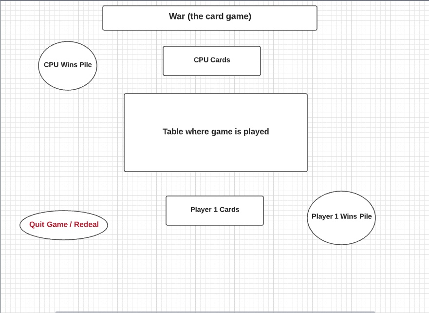
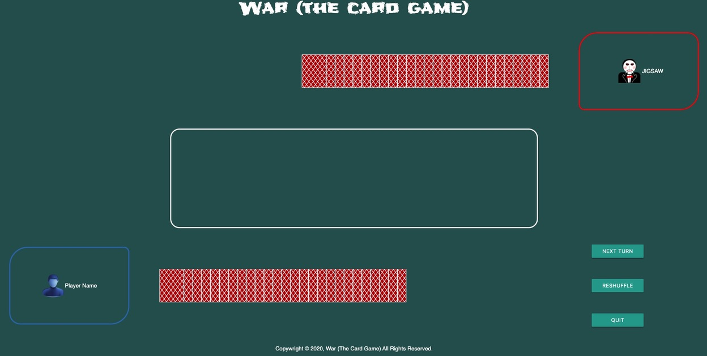
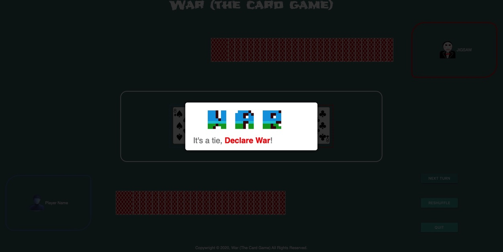

## About This Game
:spades: :hearts: :clubs: :diamonds: 
 
War is a card game I used to play as a kid.  When given the task of creating my first app I though it'd be nice to create something my own kids could play.  So I set out to create this simple game that even a child could play. 

## Rules

[Bicycle Cards How To Play War](https://bicyclecards.com/how-to-play/war/) 
 

## Wireframe

### This was my original wireframe, as you can see from the screenshots below there has been some formatting changes since the original concept.  During testing it seemed that a better user experience could be attained by changing the layout slightly. 

## Screenshots
### This is the gameboard at the start of the game
 
 

### This is a screenshot of a tie with modal showing
 
 

## Technologies Used
HTML, CSS, JavaScript - JQuery, Google Fonts, Materialize, CSS Arcade Typography, JQuery Modal :sweat_smile: 
 

## Getting Started
Click [here](https://war-the-card-game.netlify.app/) to play the game. 
 

## Future Enhancements
- [] Allow user to select avatar
- [] Allow user to select from different theme/backgrounds 
 
 
## Credits
#### Resources used to make this app
CSS ARCADE TYPOGRAPHY: SNOW BROS. (1990)\
Pixelated typeface from the arcade game Snow Bros. Drawn in CSS. 
 
 
Playing Card background [Playing Card Backgrounds](http://www.brainjar.com/css/cards/)